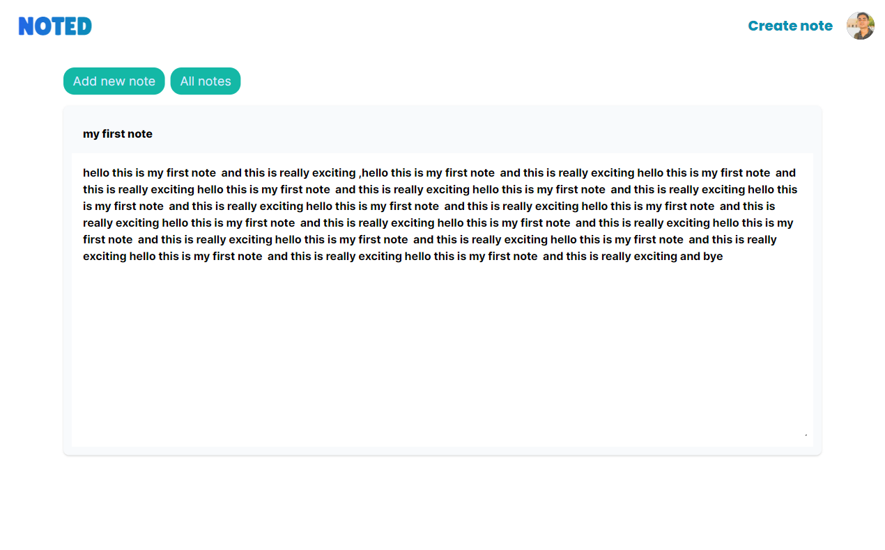

# Noted



## Demo

 <a href='tobenoted.vercel.app' target='_blank' >Noted</a>

Welcome to the Note-Taking App repository! This project is built with Next.js and NextAuth, providing a powerful and user-friendly online note-taking experience. Create, edit, and delete notes with ease, while leveraging Next.js for enhanced performance and NextAuth for secure authentication.

## Key Features

✅ Create, Edit, and Delete Notes: Seamlessly compose and organize your thoughts with the ability to create, edit, and delete notes at your fingertips.
✅ CRUD Operations: Enjoy the flexibility of performing Create, Read, Update, and Delete operations on your notes effortlessly.
✅ Next.js: Leveraging the power of Next.js, this app ensures an enhanced user experience with fast loading times and server-side rendering.
✅ NextAuth Integration: With NextAuth, you can securely authenticate and manage user accounts, providing a reliable and safe environment for your note-taking activities.
✅ Google Authentication: Seamlessly authenticate users with their Google accounts, providing a convenient and secure login option.

## Installation

To run the Note-Taking App locally, follow these steps:

### Clone the repository:

git clone https://github.com/your-username/note-taking-app.git

### Navigate to the project directory:

Copy code
cd note-taking-app

### Install the dependencies:
npm install

### Set up the environment variables:
Create a .env.local file in the root directory and add the following variables:

```js
NEXTAUTH_URL=http://localhost:3000
NextAUTH_SECRET=yoursecret
GOOGLE_CLIENT_ID=your-google-client-id
GOOGLE_CLIENT_SECRET=your-google-client-secret
```
Replace your-google-client-id and your-google-client-secret with your own Google API credentials.

### Run the development server:
```bash
npm run dev
```
Open your browser and navigate to http://localhost:3000 to access the app.
Feedback and Contributions
Your feedback and contributions are highly appreciated! If you encounter any issues, have suggestions, or want to contribute to this project, please feel free to create an issue or submit a pull request.

## Showcase
I would love to showcase any innovative uses or modifications of the Note-Taking App! If you have customized the app or integrated it into your own projects, please let us know. I'll be thrilled to feature your work here.

## Acknowledgments
Thanks to the Next.js and NextAuth communities for their invaluable resources and support.
Special thanks to the contributors of this project for their dedication and effort.
